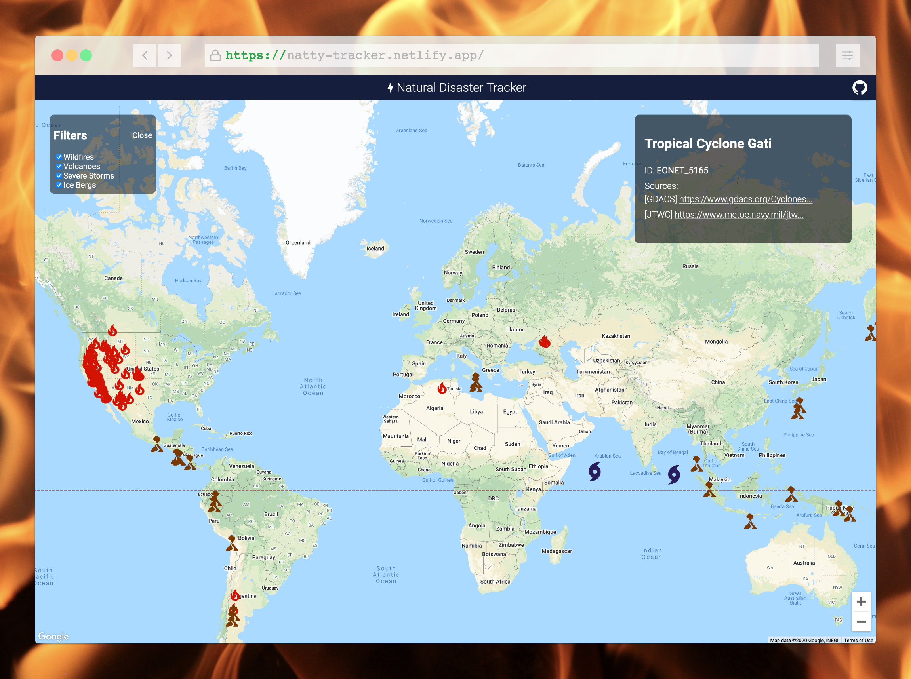

# Natural Disaster Tracker

Interactive map of natural disasters (wildfires, volcanoes, severe storms, ice bergs) around the world. Data is sourced from [NASA](https://api.nasa.gov/).



## Setup

```sh
# Clone this repository and cd into directory
$ git clone

# Install dependencies
$ npm install

# Create a .env in the root directory with your google maps API key
$ REACT_APP_GOOGLE_MAPS_API_KEY=<your-google-maps-api-key>

# Start the development server on http://localhost:3000
$ npm start

```

## Tech

- [ReactJS](https://reactjs.org/) - A JavaScript library for building user interfaces
- [google-maps-react](https://www.npmjs.com/package/google-maps-react) - declarative Google Map React component using React
- [styled-components](https://styled-components.com/) - for styled components
- [React Query](https://react-query.tanstack.com/) - for data queries
- [NASA Open API](https://api.nasa.gov/)

## Demo

https://natty-tracker.netlify.app/

## License

MIT
